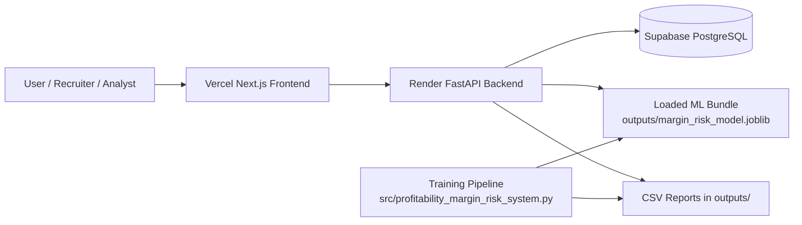
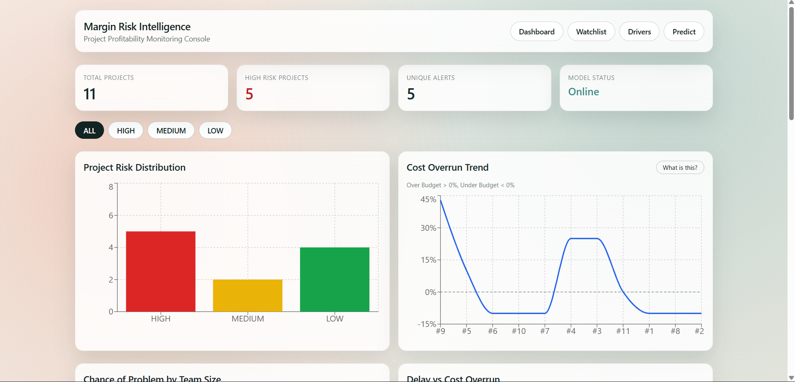
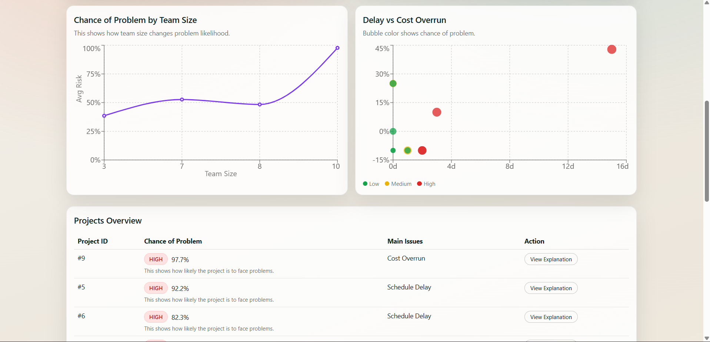
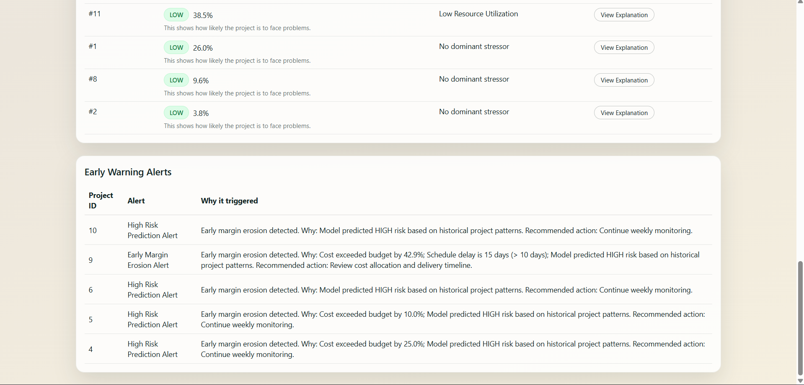
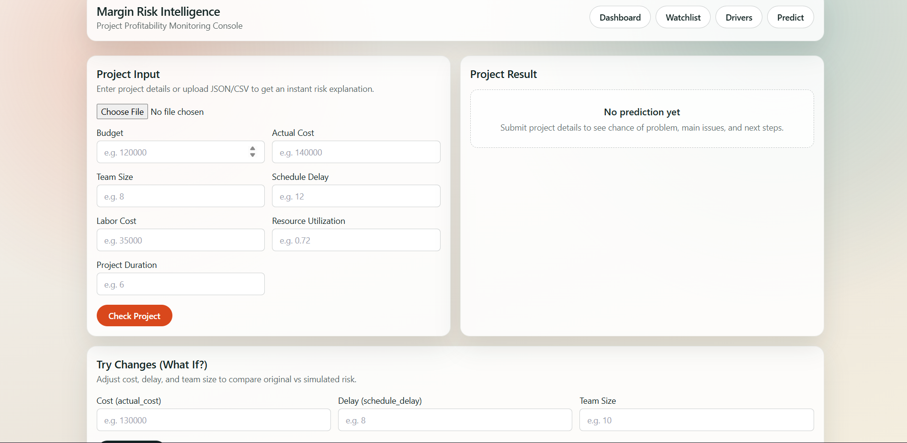
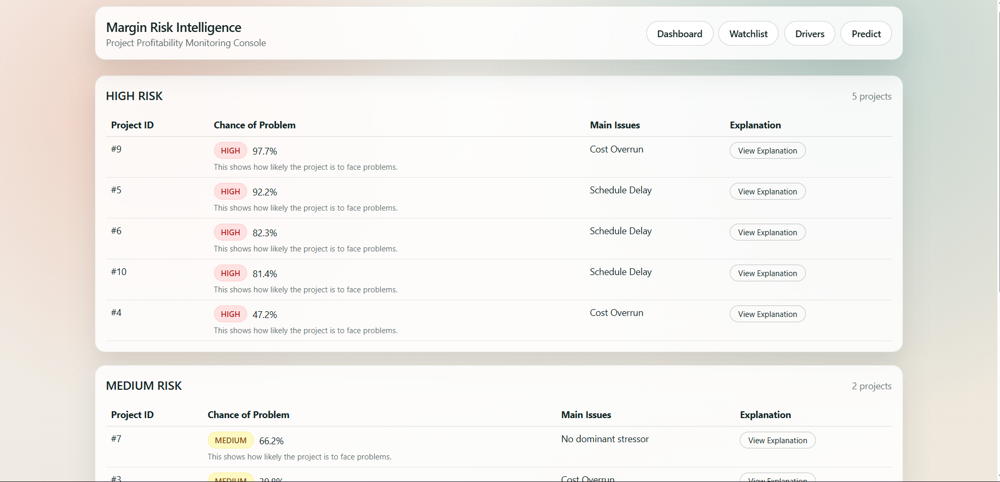

# Project Profitability & Margin Risk Intelligence System

[Frontend Live](https://project-profitability-margin-risk-i-iota.vercel.app) · [Backend Live](https://project-profitability-margin-risk.onrender.com)


Production-oriented platform for identifying margin erosion, predicting project risk, and surfacing early warning signals through an ML-backed FastAPI service and a Next.js executive dashboard.

## Overview

This repository combines a trained risk model, a database-backed API, and a web dashboard for monitoring project profitability. It is designed for a modern deployment split:

- Frontend on Vercel
- Backend on Render
- Managed PostgreSQL on Supabase

The backend loads a serialized ML bundle from `outputs/`, writes prediction records to PostgreSQL, and serves CSV-backed operational reports for the dashboard.

## ✨ Features

- Risk prediction for project margin and delivery health
- Canonical 15-feature Pydantic request schema for scoring
- PostgreSQL persistence for projects, predictions, alerts, and profit drivers
- SHAP-powered explainability for model interpretation
- CSV-backed dashboard feeds for watchlist and early warning alerts
- Next.js dashboard for executive visibility and project review
- Dockerized local stack for backend, frontend, and Postgres
- Render, Vercel, and Supabase deployment support

## 🧱 Tech Stack

| Layer | Stack |
| --- | --- |
| Frontend | Next.js 14, React 18, TypeScript, Tailwind CSS |
| Backend | FastAPI, Uvicorn, Gunicorn |
| ML / Data | Python, scikit-learn joblib bundle, pandas, NumPy, SHAP |
| Database | PostgreSQL, SQLAlchemy ORM |
| Hosting | Vercel, Render, Supabase |
| DevOps | Docker, Docker Compose |

## 🏗️ Architecture Overview



Request flow:

1. The user submits a project input from the dashboard or API client.
2. FastAPI validates the payload and loads the model lazily if needed.
3. The model produces risk outputs and SHAP-based explanation data.
4. The backend persists the project and prediction rows in PostgreSQL.
5. The dashboard consumes the API response plus CSV-backed report feeds.

## 🧠 ML Model

The model bundle is stored at `outputs/margin_risk_model.joblib` and is loaded by `backend/app/risk_engine.py`.

### Canonical prediction features

The current scoring contract expects these 15 core inputs:

| Feature | Purpose |
| --- | --- |
| `budget` | Planned project budget |
| `actual_cost` | Actual project spend |
| `revenue` | Project revenue |
| `duration` | Project duration |
| `team_size` | Team headcount |
| `risk_score` | Initial risk signal |
| `client_rating` | Client satisfaction rating |
| `project_complexity` | Complexity level |
| `profit_margin` | Margin baseline |
| `cost_variance` | Cost deviation |
| `schedule_variance` | Schedule deviation |
| `resource_utilization` | Resource efficiency |
| `dependency_score` | Delivery dependency pressure |
| `change_request_freq` | Scope churn frequency |
| `market_volatility` | External market pressure |

### What the backend derives

The engine computes additional indicators such as:

- `cost_overrun_pct`
- `labor_intensity`
- `delay_intensity`
- `efficiency_gap`
- `revenue_to_cost_ratio`

These derived metrics are used for root-cause analysis, risk labeling, and alert generation.

### Output behavior

The `/predict` endpoint returns the core risk result and stores a project snapshot plus prediction row in PostgreSQL. The model engine also produces explainability signals used by the dashboard and monitoring reports.

## 🔌 API Endpoints

Current backend routes are implemented in `backend/app/main.py`.

| Method | Endpoint | Description |
| --- | --- | --- |
| `GET` | `/` | Basic service status response |
| `GET` | `/health` | Reports backend health and model load status |
| `POST` | `/predict` | Validates the 15-feature payload, runs scoring, and persists project/prediction records |
| `GET` | `/dashboard-data` | Loads `outputs/priority_risk_watchlist.csv` and returns JSON rows |
| `GET` | `/alerts` | Loads `outputs/early_warning_alerts.csv` and returns JSON rows |

Note: the frontend includes a watchlist view backed by the dashboard data feed. In this repository snapshot, the watchlist dataset is surfaced through `/dashboard-data`.

## 🧪 Curl Examples

### Health check

```bash
curl https://project-profitability-margin-risk.onrender.com/health
```

### Predict

```bash
curl -X POST https://project-profitability-margin-risk.onrender.com/predict \
  -H "Content-Type: application/json" \
  -d '{
    "budget": 120000,
    "actual_cost": 140000,
    "revenue": 165000,
    "duration": 90,
    "team_size": 8,
    "risk_score": 0.42,
    "client_rating": 4.3,
    "project_complexity": 7,
    "profit_margin": 0.15,
    "cost_variance": 0.12,
    "schedule_variance": 9,
    "resource_utilization": 0.71,
    "dependency_score": 0.38,
    "change_request_freq": 5,
    "market_volatility": 0.28
  }'
```

### Watchlist feed

```bash
curl https://project-profitability-margin-risk.onrender.com/dashboard-data
```

### Alerts

```bash
curl https://project-profitability-margin-risk.onrender.com/alerts
```

## 📁 Folder Structure

```text
.
├── backend/
│   ├── app/
│   │   ├── main.py
│   │   ├── schemas.py
│   │   ├── models.py
│   │   ├── crud.py
│   │   ├── database.py
│   │   └── risk_engine.py
│   └── scripts/
│       ├── weekly_monitor.py
│       └── generate_shap_summary.py
├── frontend/
│   ├── app/
│   │   ├── dashboard/
│   │   ├── drivers/
│   │   ├── predict/
│   │   └── watchlist/
│   ├── components/
│   └── lib/
├── outputs/
│   ├── margin_risk_model.joblib
│   ├── priority_risk_watchlist.csv
│   ├── early_warning_alerts.csv
│   └── global_profitability_drivers.csv
├── src/
│   └── profitability_margin_risk_system.py
├── docker-compose.yml
├── render.yaml
├── init_db.py
└── requirements.txt
```

## ⚙️ Installation

### Prerequisites

- Python 3.11+
- Node.js 18+
- PostgreSQL 15 or Supabase Postgres
- Docker Desktop optional but recommended

### Clone and install

```bash
git clone <your-repo-url>
cd Project-Profitability-Margin-Risk-Intelligence-System
python -m venv .venv
.venv\Scripts\activate
python -m pip install --upgrade pip
python -m pip install -r requirements.txt
cd frontend
npm install
cd ..
```

## 🔐 Environment Variables

Use `.env.example` as the starting point.

| Variable | Scope | Purpose | Example |
| --- | --- | --- | --- |
| `DATABASE_URL` | Backend | PostgreSQL connection string, including Supabase | `postgresql://postgres:<password>@<host>:5432/postgres` |
| `CORS_ORIGINS` | Backend | Allowed frontend origins | `http://localhost:3000,https://project-profitability-margin-risk-i-iota.vercel.app` |
| `ENVIRONMENT` | Backend | Controls dev vs production runtime behavior | `development` or `production` |
| `MODEL_PATH` | Backend | Path to the trained joblib bundle | `outputs/margin_risk_model.joblib` |
| `NEXT_PUBLIC_API_URL` | Frontend | Backend API base URL | `http://localhost:8000` or `https://project-profitability-margin-risk.onrender.com` |

For production, Supabase is used as the managed PostgreSQL host through `DATABASE_URL`. No direct Supabase SDK is required for the current backend implementation.

## 🧑‍💻 Local Development

### Backend

```bash
python init_db.py
python -m uvicorn backend.app.main:app --reload --host 0.0.0.0 --port 8000
```

### Frontend

```bash
cd frontend
npm run dev
```

Recommended local URLs:

- Frontend: `http://localhost:3000`
- Backend: `http://localhost:8000`
- API docs: `http://localhost:8000/docs`

## 🐳 Docker Usage

Start the full stack with Docker Compose:

```bash
docker compose up --build
```

Services in `docker-compose.yml`:

- `database` - PostgreSQL 15 for local development
- `backend` - FastAPI application
- `frontend` - Next.js production server

Default container routing:

- Frontend: `http://localhost:3000`
- Backend: `http://localhost:8000`
- PostgreSQL: `localhost:5432`

## 🚀 Deployment Guide

### Backend on Render

- Use `render.yaml` or create a Render web service manually.
- Set `rootDir` to `backend`.
- Set `DATABASE_URL` to your Supabase connection string.
- Set `CORS_ORIGINS` to your Vercel domain and any local origins you need.
- Set `MODEL_PATH=outputs/margin_risk_model.joblib`.

### Frontend on Vercel

- Import the `frontend` directory as the app root.
- Set `NEXT_PUBLIC_API_URL` to the Render backend URL.
- Redeploy after any backend URL change.

### Supabase Database

- Create a new Supabase project.
- Copy the PostgreSQL connection string into `DATABASE_URL`.
- Ensure the required tables are created with `python init_db.py` or on first backend startup.

### Deployment topology

1. Vercel serves the Next.js dashboard.
2. Render serves the FastAPI API.
3. Supabase stores projects, predictions, alerts, and driver data.
4. The backend reads the trained model bundle and CSV reports from `outputs/`.

## 🖼️ Screenshots

### Executive Dashboard Overview


*Real-time risk monitoring with cost overrun trends, team size analysis, and early warning alerts.*

### Dashboard Analytics & Risk Heatmap


*Profitability driver importance chart and project health status indicators.*

### Dashboard Alerts & Summary


*Early warning rule triggers, risk classification summary, and model performance metrics.*

### Project Risk Prediction


*Interactive prediction interface with 15-feature input form and risk assessment results with SHAP explanations.*

### High-Risk Projects Watchlist


*Prioritized list of high-risk projects with cost overrun status, schedule delays, and recommended mitigation actions.*

## 🔮 Future Improvements

- Add a dedicated migration workflow for PostgreSQL schema changes
- Expose the watchlist and driver feeds through explicit API endpoints
- Add authentication and role-based access for enterprise use
- Add automated model retraining and scheduled report refresh jobs
- Add CI checks for backend, frontend, and Markdown documentation

## 👤 Author

Project maintained by the repository owner.

---

This README reflects the current production architecture and live deployment layout for the repository.
